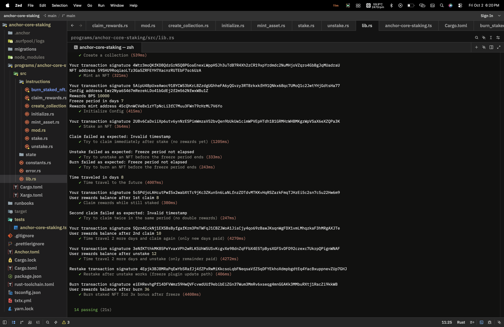

# FT Staking Core — Anchor + Metaplex Core

> Build on top of the existing Core NFT staking program or create your own from scratch.

A fully on-chain NFT staking program built with **Anchor 0.31.1** and **Metaplex Core (mpl-core)**. Users stake Core NFTs from a managed collection, earn SPL reward tokens per day staked, claim rewards without unstaking, or permanently burn their NFT for a **3× bonus reward**.

---

## Table of Contents

- [Overview](#overview)
- [Features](#features)
- [Architecture](#architecture)
- [Program Instructions](#program-instructions)
- [PDAs & Accounts](#pdas--accounts)
- [Reward Formula](#reward-formula)
- [Error Codes](#error-codes)
- [Project Structure](#project-structure)
- [Prerequisites](#prerequisites)
- [Build](#build)
- [Deploy & Test](#deploy--test)
- [Test Suite](#test-suite)
- [Toolchain Notes](#toolchain-notes)

---

## Overview

This program implements **Task 1** of the FT Staking Core challenge:

| Task | Feature | Status |
|------|---------|--------|
| 1.1 | **Claim Rewards Without Unstaking** — collect accumulated tokens while NFT stays staked & frozen | ✅ |
| 1.2 | **Burn-to-Earn with BurnDelegate** — permanently burn staked NFT for a 3× one-time reward bonus | ✅ |
| 1.3 | **Collection-Level Staking Stats** — `total_staked` counter tracked as an Attribute on the Collection account | ✅ |

---

## Features

- **Freeze-on-stake** — uses the MPL Core `FreezeDelegate` plugin to lock the NFT while staked; it cannot be transferred or listed
- **Attribute-based state** — staking metadata (`staked`, `staked_at`, `last_claimed_at`) is stored as MPL Core `Attributes` directly on the NFT asset — zero extra Solana accounts needed
- **Daily reward accrual** — rewards accumulate per whole day staked; fractional days are truncated (integer division)
- **Claim cursor** — `last_claimed_at` tracks the last claim timestamp so rewards are never double-counted across multiple `claim_rewards` calls
- **Freeze period gate** — unstake and burn are gated behind a configurable minimum freeze period (in days)
- **Re-stake support** — after unstaking, the NFT can be re-staked; the `FreezeDelegate` plugin is reused (update path) instead of added again
- **3× burn bonus** — `burn_staked_nft` thaws the NFT, burns it via `BurnV1CpiBuilder`, then mints `days_since_last_claim × rewards_bps × 3` tokens

---

## Architecture

```
Config PDA [config, collection]
  rewards_bps   (u16) – reward rate in basis points
  freeze_period (u16) – min stake days before unstake/burn
  rewards_bump  (u8)  – bump for rewards_mint PDA
  bump          (u8)  – self bump

Rewards Mint PDA [rewards_mint, config]
  SPL token minted as rewards; authority = Config PDA

Update Authority PDA [update_authority, collection]
  Signs all MPL Core Attributes & FreezeDelegate plugin CPIs

NFT Asset (BaseAssetV1) — MPL Core on-chain account
  Attributes Plugin:
    staked          = "true" | "false"
    staked_at       = unix timestamp (seconds)
    last_claimed_at = unix timestamp (0 = never claimed)
  FreezeDelegate Plugin:
    frozen = true  (while staked)
    frozen = false (after unstake / before burn)
```

---

## Program Instructions

### `initialize`
Sets up the staking program for a collection.

| Param | Type | Description |
|-------|------|-------------|
| `rewards_bps` | `u16` | Reward rate in basis points (10000 = 100% = 1 token/day) |
| `freeze_period` | `u16` | Minimum days an NFT must be staked before unstaking |

### `create_collection`
Creates a new Metaplex Core collection with the program's PDA as update authority.

**Args:** `name: String`, `uri: String`

### `mint_asset`
Mints a new Core NFT into the collection.

**Args:** `name: String`, `uri: String`

### `stake`
Stakes a Core NFT.

1. Reads existing `Attributes` plugin (if present)
2. Ensures the NFT is not already staked (`staked == "false"`)
3. Writes `staked = "true"`, `staked_at = <now>`, `last_claimed_at = "0"`
4. Freezes the NFT via `FreezeDelegate` plugin (`frozen = true`)

### `claim_rewards` ⭐ Task 1.1
Claims accumulated rewards **without unstaking**.

1. Reads `Attributes` — verifies NFT is staked
2. Computes `days = (now - last_claimed_at) / 86400`
3. Requires `days > 0` — prevents same-day double claims (`InvalidTimestamp`)
4. Updates `last_claimed_at = now` on the NFT's `Attributes` plugin (NFT stays frozen)
5. Mints `days × rewards_bps / 10000` reward tokens to user's ATA

> The NFT remains staked and frozen throughout. Only the claim cursor advances.

### `unstake`
Unstakes a Core NFT after the freeze period, paying out remaining rewards.

1. Verifies `total_days_staked >= freeze_period`
2. Pays out unclaimed rewards since `last_claimed_at`
3. Resets attributes: `staked = "false"`, `staked_at = "0"`, `last_claimed_at = "0"`
4. Thaws the NFT (`FreezeDelegate { frozen: false }`)

### `burn_staked_nft` ⭐ Task 1.2
Permanently burns a staked NFT for a **3× reward bonus**.

1. Verifies NFT is staked and freeze period has elapsed
2. Computes unclaimed days since `last_claimed_at`
3. Thaws the NFT (`FreezeDelegate { frozen: false }`) — required before burn
4. Burns the NFT via `BurnV1CpiBuilder`
5. Mints `days × rewards_bps / 10000 × 3` reward tokens to user's ATA

> The NFT is permanently destroyed. Reward = 3× normal daily rate for unclaimed days.

---

## PDAs & Accounts

| PDA | Seeds | Description |
|-----|-------|-------------|
| `config` | `[b"config", collection.key()]` | Staking config |
| `rewards_mint` | `[b"rewards_mint", config.key()]` | SPL mint; config PDA is mint authority |
| `update_authority` | `[b"update_authority", collection.key()]` | Signs all MPL Core plugin CPIs |

---

## Reward Formula

```
rewards = floor(elapsed_days × rewards_bps / 10000) × 10^decimals
burn_rewards = rewards × 3   (burn_staked_nft only)
```

**Example** (test defaults: `rewards_bps = 10000`, `decimals = 0`):

| Scenario | Days | Multiplier | Tokens |
|----------|------|-----------|--------|
| `claim_rewards` after 8 days | 8 | 1× | 8 |
| `claim_rewards` 2 days later | 2 | 1× | 2 |
| `unstake` 2 days later | 2 | 1× | 2 |
| `burn_staked_nft` (12 days unclaimed) | 12 | **3×** | **36** |

---

## Error Codes

| Code | Name | When |
|------|------|------|
| 6000 | `InvalidOwner` | Signer is not the NFT owner |
| 6001 | `InvalidUpdateAuthority` | Collection update authority mismatch |
| 6002 | `AlreadyStaked` | NFT is already staked |
| 6003 | `AssetNotStaked` | NFT is not staked |
| 6004 | `InvalidTimestamp` | Parse error or `days == 0` (no rewards yet) |
| 6005 | `FreezePeriodNotElapsed` | Unstake/burn before minimum freeze period |
| 6006 | `InvalidRewardsBps` | Arithmetic overflow in rewards calculation |

---

## Project Structure

```
anchor-core-staking/
├── Anchor.toml                          # Anchor config (toolchain, cluster, program IDs)
├── Cargo.toml                           # Workspace manifest
├── rust-toolchain.toml                  # Pins to 1.89.0-sbpf-solana-v1.52
├── programs/
│   └── anchor-core-staking/
│       ├── Cargo.toml                   # Program deps (anchor-lang, anchor-spl, mpl-core)
│       └── src/
│           ├── lib.rs                   # Program entrypoint & instruction routing
│           ├── constants.rs             # Shared constants
│           ├── error.rs                 # Custom error codes
│           ├── state/
│           │   └── config.rs            # Config account struct
│           └── instructions/
│               ├── initialize.rs        # Initialize staking config & rewards mint
│               ├── create_collection.rs # Create MPL Core collection
│               ├── mint_asset.rs        # Mint Core NFT into collection
│               ├── stake.rs             # Stake NFT (freeze + set attributes)
│               ├── unstake.rs           # Unstake (thaw + pay rewards + reset)
│               ├── claim_rewards.rs     # Claim rewards without unstaking ⭐
│               └── burn_staked_nft.rs   # Burn-to-earn with 3x bonus ⭐
└── tests/
    └── anchor-core-staking.ts           # Full integration test suite (14 tests)
```

---

## Prerequisites

| Tool | Version | Notes |
|------|---------|-------|
| Rust | 1.89.0 (`sbpf-solana-v1.52`) | Via rustup |
| Solana CLI | 3.1.10 | Platform-tools v1.52 (rustc 1.89.0) |
| Anchor CLI | 0.31.1 | `cargo install --git https://github.com/coral-xyz/anchor anchor-cli --tag v0.31.1` |
| Node.js | ≥18 | For tests |
| Yarn | 1.x | `npm install -g yarn` |
| Surfpool | latest | Required for `surfnet_timeTravel` in tests |

---

## Build

```bash
yarn install
anchor build
```

Outputs:
- `target/deploy/anchor_core_staking.so`
- `target/idl/anchor_core_staking.json`
- `target/types/anchor_core_staking.ts`

---

## Deploy & Test

Tests use **Surfpool** for `surfnet_timeTravel`. Regular `solana-test-validator` will not work.

**Terminal 1 — start Surfpool:**
```bash
surfpool start
```

**Terminal 2 — deploy and test:**
```bash
anchor deploy
anchor test --skip-build --skip-deploy
```

After code changes:
```bash
anchor build && anchor deploy && anchor test --skip-build --skip-deploy
```

---

## Test Suite

```
anchor-core-staking
  ✔ Create a collection
  ✔ Mint an NFT
  ✔ Initialize Config
  ✔ Stake an NFT
  ✔ Try to claim immediately after stake (no rewards yet)      → InvalidTimestamp
  ✔ Try to unstake before freeze period ends                   → FreezePeriodNotElapsed
  ✔ Try to burn before freeze period ends                      → FreezePeriodNotElapsed
  ✔ Time travel to the future (8 days via surfnet_timeTravel)
  ✔ Claim rewards while still staked                           → balance = 8
  ✔ Try to claim twice in same period                          → InvalidTimestamp
  ✔ Time travel 2 more days and claim again                    → balance = 10
  ✔ Time travel 2 more days and unstake (remainder paid)       → balance = 12
  ✔ Restake after unstake works (FreezeDelegate update path)
  ✔ Burn staked NFT for 3x bonus after freeze                  → balance = 36

14 passing (~21s)
```



---

## Toolchain Notes

`mpl-core 0.11.x` pulls in crates that require Rust edition 2024 (`block-buffer 0.12`, `digest 0.11`). Only platform-tools v1.52+ (rustc 1.89.0) can compile these.

```toml
# Anchor.toml
[toolchain]
anchor_version = "0.31.1"
solana_version = "3.1.10"   # forces platform-tools v1.52 (rustc 1.89.0)
```

```toml
# Cargo.toml
edition = "2021"   # Anchor 0.31.1 IDL builder does not parse edition "2024"
```

```toml
# rust-toolchain.toml
[toolchain]
channel = "1.89.0-sbpf-solana-v1.52"
```
